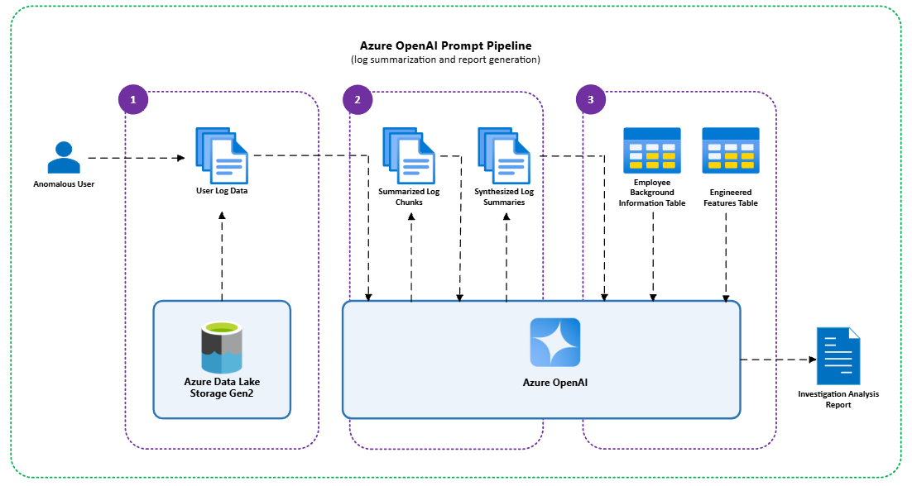

# AOAI Anomalous User Investigation

### Why use AOAI?

Azure OpenAI (AOAI) is leveraged in this project to simulate the reasoning of a cybersecurity analyst. AOAI combines user background information, engineered features, and event log summaries to produce a structured investigation report. This approach enhances the detection and investigation process by providing a comprehensive understanding of user behavior and potential risks.

**Additional Benefits for Cybersecurity Specialists:**

* **Expedited Workflows:** AOAI can significantly speed up the analysis by quickly processing large volumes of data and generating insights.
* **Second Review:** AOAI provides an additional layer of analysis, acting as a second review to validate findings and ensure potential threats are not overlooked.
* **Scalability:** AOAI can handle large datasets and complex scenarios, making it suitable for organizations with large and diverse data sources.
* **Enhanced Detection:** AOAI can detect subtle and complex patterns that might be missed by traditional methods.

---

### Investigate Anomalies ([aoai_investigate_anomalies.ipynb](aoai_investigate_anomalies.ipynb))
## AOAI Insider Threat Analysis
This notebook leverages Azure OpenAI (AOAI) to simulate the reasoning of a cybersecurity analyst. Once users have been nominated as anomalous (e.g., via the train_isolation_forest.ipynb script), this notebook is used to investigate and explain their behavior using log summaries and engineered features.

##### Approach
_Log types: device, email, file, HTTP, logon logs_

- **Step 1) Log Retrieval:** The analysis window is dynamically computed based on each users most recent activity. The investigation covers a variable-defined time range (currently set to 60 days) ending at the users last known activity. Each log type dataset is queried to retrieve the users activity for this time range.

- **Step 2) Log Summarization:** For each log type, the logs are broken into manageable chunks and summarized individually with AOAI. Each chunk summary highlights suspicious behavior, flags relevant entries, and assigns relevance scores. These chunks are then synthesized into a single summary for each log type.

- **Step 3) Final Report Generation:** AOAI leverages the log summaries and additional context to generate a structured report that includes: user summary and background, behavioral patterns and anomalies, timeline of suspicious events, and risk assessment and recommendations.

## Sample Insider Threat Investigation Report (from AOAI)

  
📄 Sample Report (click to expand)

---

**User Summary**  
User: [Redacted Employee] [UserID-XXXX] — IT Administrator in the Security department with privileged access across multiple systems.

Time Window Analyzed: 2023-06-01 to 2023-07-31

**Behavior Summary**  
During the analysis period, the user exhibited a notable decrease in overall activity volume compared to baseline, but with a concentration of high-risk behaviors. These included repeated after-hours system access, frequent USB and file transfer activity (especially to removable media), extensive external email communications with large attachments, and persistent access to suspicious web domains. Notably, the user also copied and _**executed a file identified as a potential keylogger or surveillance tool**_. These behaviors, particularly on a primary workstation, represent a significant deviation from prior patterns.

**Anomalous Activities**  
1. **Frequent USB and Removable Media Activity**
    * Numerous rapid connect/disconnect cycles per day, including short-duration and after-hours usage, suggesting potential data exfiltration or evasion of monitoring.

2. **Large-Scale File Transfers to Removable Media**
    * High-volume transfers of documents, compressed archives, and executable files—some flagged as potentially malicious—often occurring outside business hours.

3. **Suspicious External Email Communications**
    * Repeated emails to personal and non-corporate domains, often with large attachments and vague or repetitive content, indicating possible data leakage.

4. **Access to Risky Web Domains**
    * Persistent access to known file-sharing and obfuscated domains associated with malware or exfiltration behavior, including sites previously linked to keylogger distribution.

5. **After-Hours and Multi-System Logon Patterns**
    * Repeated logons across multiple systems outside standard business hours, deviating from baseline usage patterns.

**Anomalous Timeline of Events**  
* **2023-07-30** - Multiple USB connect/disconnect cycles; copying and execution of a flagged executable suspected to be a keylogger; extended after-hours session; access to suspicious web domains.

* **2023-07-25 to 2023-07-29** - Bursts of file transfer activity; short-duration logons on secondary systems; continued access to risky URLs.

* **2023-07-10 to 2023-07-20** - High-volume file transfers to removable media; frequent USB cycling; repetitive access to encoded URLs and file-sharing services.

* **2023-06-15 to 2023-06-20** - External email with large attachment to multiple non-corporate recipients; ambiguous internal communications; after-hours logons.
  
* **2023-06-01 to 2023-06-10** - Initial spike in after-hours logons and USB activity across several systems.

**Risk Assessment**  
- Risk Level: High  
- Justification: The user demonstrates multiple concurrent high-risk behaviors—large-scale file transfers (including a suspected keylogger), abnormal USB activity, suspicious communications, and access to malicious web resources—across several vectors and timeframes. These activities significantly deviate from baseline and align with known insider threat and data exfiltration patterns.

**Recommendations**  
- Escalate for full forensic investigation of the user’s systems and removable media.
- Review flagged emails and file transfers, especially external attachments.
- Correlate after-hours activity with file access and network logs.
- Temporarily suspend or restrict privileged access pending investigation.
- Conduct a formal interview to assess business justification for observed behaviors.
- Increase monitoring of related accounts and endpoints for potential lateral movement.

---

