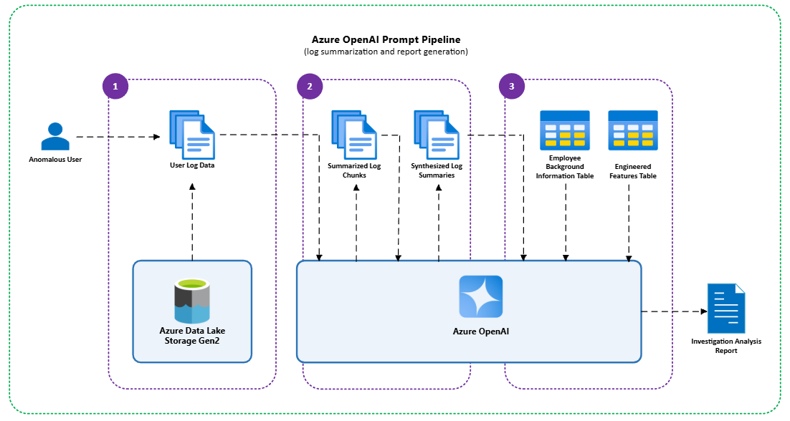

# Insider Threat Detection with Azure Synapse and Azure OpenAI

_Brief Summary: Detect and investigate insider threats using anomaly detection and generative AI. This solution uses **_Azure Synapse, SynapseML, and Azure OpenAI_** to build a scalable solution for identifying and analyzing anomalous user behavior._

Insider threats remain one of the most challenging security risks to detect and mitigate. Unlike external threats, insiders have legitimate access, making their actions harder to distinguish from normal activity. According to the 2025 Verizon Data Breach Investigations Report, 18% of breaches involve internal actors. This underscores the critical need for advanced detection capabilities, as insider threats are often among the most difficult to detect and the most damaging when compromised.
 
To address this challenge, organizations require a modern, cloud-native approach that combines behavioral analytics with generative AI. This article outlines a high-level solution using Azure Synapse and Azure OpenAI to detect and investigate insider threats. The result is an AI-generated investigation report for each flagged insider threat, summarizing anomalous behaviors, risk levels, and recommended actions - empowering analysts to act swiftly and effectively.

---
## 📌 Project Overview
Modern four-step approach to insider threat detection:
1. **Data Ingestion and Storage** – Structured user log data is stored in Azure Data Lake Storage Gen 2. 

2. **Data Processing and Feature Engineering** – Logs are cleaned and user behavior features are extracted using Spark in Azure Synapse. 

3. **Anomaly Detection** – Anomalous users are flagged by an anomaly detection algorithm in SynapseML. 

4. **Generative AI User Investigation** – Flagged user activity is analyzed and summarized into structured reports using Azure OpenAI. 

---
## 🚀 Technologies Used
- **Azure Synapse Analytics** (Spark & SQL)
- **Azure SynapseML** (Isolation Forest for anomaly detection)
- **Azure OpenAI** (GPT-4)
- **Azure Blob Storage**

---
## 📁 Dataset
The [CMU CERT Insider Threat v4.2 Dataset](https://resources.sei.cmu.edu/library/asset-view.cfm?assetID=508099) simulates realistic insider threat scenarios using synthetic data including:
- `logon.csv`: User logon/logoff events
- `file.csv`: File transfers to removable devices
- `http.csv`: Web browsing history
- `email.csv`: Email metadata (to/from, size, attachments)
- `device.csv`: Device connection logs (e.g., USB usage)
- `LDAP/`: Organizational hierarchy snapshots
- \* `psychometric.csv`: Personality profile data

All files were ingested into **Azure Blob Storage**, then queried and cleaned in **Azure Synapse Notebooks**.

\* _Note: Psychometric data was intentionally excluded from analysis due to ethical and privacy considerations._

---
## 🔄 Workflow
### 1. **Data Ingestion**
- Upload dataset `csv` files into Azure Data Lake Storage Gen2
- Connect the data lake container to Synapse as a linked service

### 2. **Data Processing & Feature Engineering**
- Explore data with Synapse SQL
- Clean and standardize records using Spark in Synapse Notebooks ([01_data_cleaning](01_data_cleaning))
- Generate model features from the cleaned log datasets ([engineer_model_features.ipynb](02_anomaly_detection/engineer_model_features.ipynb))

### 2. **Anomaly Detection**
- Train an _Isolation Forest_ model using SynapseML and flag the top 7% of most anomalous users ([train_isolation_forest.ipynb](02_anomaly_detection/train_isolation_forest.ipynb))

### 3. **Generative AI User Investigation**
Once users are flagged as anomalous by the Isolation Forest model, Azure OpenAI (AOAI) is used to simulate the reasoning of a cybersecurity analyst ([aoai_investigate_anomalies.ipynb](03_aoai_user_investigation/aoai_investigate_anomalies.ipynb)). 

For each user, the process is as follows: 
* **Log Retrieval:** Pull logs from each data source for a 60-day window ending at the user’s most recent activity. 
* **Log Summarization:** For each log source, the logs are broken into manageable chunks. Azure Open AI analyzes and summarizes each chunk to identify unusual access patterns or suspicious events and assigns relevance scores based on event severity. Azure OpenAI then synthesizes the chunk-level summaries into a single summary per log source, highlighting the most critical behaviors.  
* **Final Report Generation:** The synthesized summaries are combined with user background information and engineered features to produce a structured report. The report includes a behavior summary, timeline of anomalous events, risk assessment, and recommended next steps. 

This approach enables analysts to quickly understand the context and severity of anomalous behavior without manually reviewing raw logs.

#### Example AOAI Final Investigation Analysis Output

## Sample Insider Threat Investigation Report (from AOAI)

  
📄 Sample Report (click to expand)

**User Summary**  
User: [Redacted Employee] [UserID-XXXX] — IT Administrator in the Security department with privileged access across multiple systems.

Time Window Analyzed: 2023-06-01 to 2023-07-31

**Behavior Summary**  
During the analysis period, the user exhibited a notable decrease in overall activity volume compared to baseline, but with a concentration of high-risk behaviors. These included repeated after-hours system access, frequent USB and file transfer activity (especially to removable media), extensive external email communications with large attachments, and persistent access to suspicious web domains. Notably, the user also copied and _**executed a file identified as a potential keylogger or surveillance tool**_. These behaviors, particularly on a primary workstation, represent a significant deviation from prior patterns.

**Anomalous Activities**  
1. **Frequent USB and Removable Media Activity**
    * Numerous rapid connect/disconnect cycles per day, including short-duration and after-hours usage, suggesting potential data exfiltration or evasion of monitoring.

2. **Large-Scale File Transfers to Removable Media**
    * High-volume transfers of documents, compressed archives, and executable files—some flagged as potentially malicious—often occurring outside business hours.

3. **Suspicious External Email Communications**
    * Repeated emails to personal and non-corporate domains, often with large attachments and vague or repetitive content, indicating possible data leakage.

4. **Access to Risky Web Domains**
    * Persistent access to known file-sharing and obfuscated domains associated with malware or exfiltration behavior, including sites previously linked to keylogger distribution.

5. **After-Hours and Multi-System Logon Patterns**
    * Repeated logons across multiple systems outside standard business hours, deviating from baseline usage patterns.

**Anomalous Timeline of Events**  
* **2023-07-30** - Multiple USB connect/disconnect cycles; copying and execution of a flagged executable suspected to be a keylogger; extended after-hours session; access to suspicious web domains.

* **2023-07-25 to 2023-07-29** - Bursts of file transfer activity; short-duration logons on secondary systems; continued access to risky URLs.

* **2023-07-10 to 2023-07-20** - High-volume file transfers to removable media; frequent USB cycling; repetitive access to encoded URLs and file-sharing services.

* **2023-06-15 to 2023-06-20** - External email with large attachment to multiple non-corporate recipients; ambiguous internal communications; after-hours logons.
  
* **2023-06-01 to 2023-06-10** - Initial spike in after-hours logons and USB activity across several systems.

**Risk Assessment**  
- Risk Level: High  
- Justification: The user demonstrates multiple concurrent high-risk behaviors—large-scale file transfers (including a suspected keylogger), abnormal USB activity, suspicious communications, and access to malicious web resources—across several vectors and timeframes. These activities significantly deviate from baseline and align with known insider threat and data exfiltration patterns.

**Recommendations**  
- Escalate for full forensic investigation of the user’s systems and removable media.
- Review flagged emails and file transfers, especially external attachments.
- Correlate after-hours activity with file access and network logs.
- Temporarily suspend or restrict privileged access pending investigation.
- Conduct a formal interview to assess business justification for observed behaviors.
- Increase monitoring of related accounts and endpoints for potential lateral movement.

---

## 🧠 Design Decisions
### Why Use a Baseline/Recent Window? Why 60 days and 14 days?
I adopted a dual-window approach (60-day baseline, 14-day recent) to capture both long-term behavioral norms and short-term anomalies. The 60-day baseline provides a stable view of a user’s normal behavior, smoothing out short-term fluctuations. The 14-day recent window is short enough to detect sudden behavioral shifts, such as spikes in after-hours activity, external communications, or suspicious web browsing, that often precede insider threat incidents. This dual-window approach enables the model to compute meaningful spike ratios and prioritize users with the most significant deviations.

### Why Use AOAI for Summarization?
Rather than relying on static rules or dashboards, we use Azure OpenAI to simulate the reasoning of a cybersecurity analyst. This enables nuanced interpretation of log data, contextual risk assessment, and structured reporting that accelerates analyst workflows.

---

### ✅ Requirements
* Azure Subscription with:
  * Synapse workspace (with Spark pool)
  * Azure OpenAI resource (GPT-4)
  * Storage account (Blob)
  
### 🛠️ Setup Instructions
1. Clone repo and upload notebooks to into Synapse
2. Upload dataset files into an Azure Blob Storage
3. Link storage container in Synapse Studio
4. Run notebooks sequentially:
   - [01_data_cleaning](01_data_cleaning)
   - [02_anomaly_detection/engineer_model_features.ipynb](02_anomaly_detection/engineer_model_features.ipynb)
   - [02_anomaly_detection/train_isolation_forest.ipynb](02_anomaly_detection/train_isolation_forest.ipynb)
   - [03_aoai_user_investigation/aoai_investigate_anomalies.ipynb](03_aoai_user_investigation/aoai_investigate_anomalies.ipynb)

---

## 🧱 Project Structure
📦 azure_insider_threat_detection \
├── **01_data_cleaning/** \
│ ├── clean_device_events.ipynb \
│ ├── clean_email_events.ipynb \
│ ├── clean_file_events.ipynb \
│ └── clean_http_events.ipynb \
│ └── clean_logon_events.ipynb \
│ └── clean_user_details.ipynb (LDAP dataset) \
├── **02_anomaly_detection/** \
│ ├── engineer_model_features.ipynb \
│ └── train_isolation_forest.ipynb \
│ └── README.md \
├── **03_aoai_user_investigation/** \
│ └── aoai_investigate_anomalies.ipynb \
│ └── example_aoai_anomaly_analysis_output.md \
│ └── prompt_pipeline.png \
│ └── README.md \
└── README.md \
└── license.txt \
└── workflow.png

---

### 📌 Future Work
* Automate the workflow with Synapse Pipelines or Azure Data Factory. While this solution is implemented as a prototype, it is designed using scalable Azure components that support large volumes of data. The architecture can be extended into production pipelines.
* Add graph-based user behavior modeling
* Experiment with time-series anomaly models (e.g., VAE, LSTM)

### 🔒 Responsible AI Note
This project uses synthetic data and should not be used for production security monitoring without compliance review. When using LLMs for anomaly analysis, consider explainability, bias, and privacy concerns.

### ⚠️ **Disclaimer**
This repository is part of a learning project and is not an official Microsoft product or endorsed solution. It uses the CERT Insider Threat Dataset v4.2 from Carnegie Mellon University SEI for learning. No raw dataset is included here. To access the dataset, please visit the [official SEI site](https://resources.sei.cmu.edu/library/asset-view.cfm?assetID=508099).

### 📣 Contact
Simra Ali
💼 [LinkedIn](https://www.linkedin.com/in/simra-ali/)
