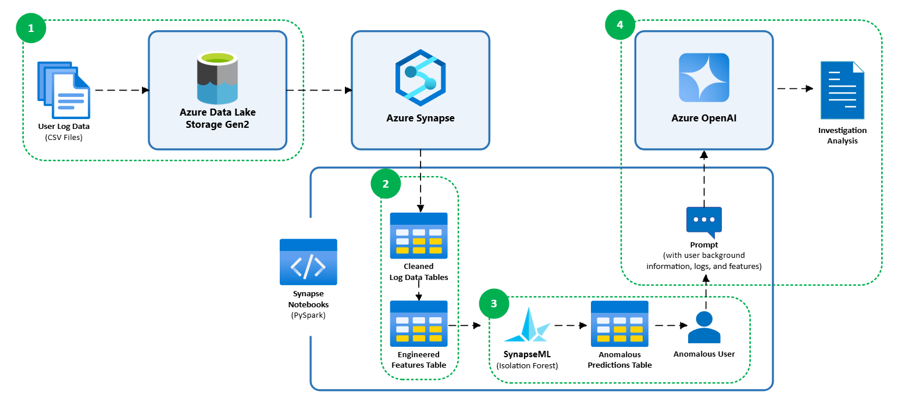

# Insider Threat Detection with Azure Synapse and Azure OpenAI

_Brief Summary: Detect and investigate insider threats using anomaly detection and generative AI. This solution uses **_Azure Synapse, SynapseML, and Azure OpenAI_** to build a scalable solution for identifying and analyzing anomalous user behavior._

Insider threats remain one of the most challenging security risks to detect and mitigate. Unlike external threats, insiders have legitimate access, making their actions harder to distinguish from normal activity. According to the 2025 Verizon Data Breach Investigations Report, 18% of breaches involve internal actors. This statistic underscores a significant risk, as trusted personnel are often among the most difficult to detect and the most damaging when compromised. 
 
To effectively respond to this challenge, organizations need a modern, cloud-based approach that integrates behavioral analytics with generative AI. This repository presents a high-level solution that leverages Azure Synapse and Azure OpenAI to detect and investigate insider threats to help cybersecurity analysts prioritize the most critical risks. 

---
## 📌 Project Overview
Modern four-step approach to insider threat detection:
1. **Data Ingestion and Storage** – Store structured user log data in Azure Data Lake Storage Gen 2 
2. **Data Processing and Feature Engineering** – Clean logs and extract user behavior features with Spark in Azure Synapse 
3. **Anomaly Detection** – Train and run an anomaly detection model to flag anomalous users with SynapseML 
4. **Generative AI User Investigation** – Analyze and summarize flagged user activity into structured reports with Azure OpenAI 



---
## 🚀 Technologies Used
- **Azure Synapse Analytics** (Spark & SQL)
- **Azure SynapseML** (Isolation Forest for anomaly detection)
- **Azure OpenAI** (GPT-4)
- **Azure Blob Storage**

---
## 📁 Dataset
The [CMU CERT Insider Threat v4.2 Dataset](https://resources.sei.cmu.edu/library/asset-view.cfm?assetID=508099) simulates realistic insider threat scenarios using synthetic data including:
- `logon.csv`: User logon/logoff events
- `file.csv`: File transfers to removable devices
- `http.csv`: Web browsing history
- `email.csv`: Email metadata (to/from, size, attachments)
- `device.csv`: Device connection logs (e.g., USB usage)
- `LDAP/`: Organizational hierarchy snapshots
- \* `psychometric.csv`: Personality profile data

All files were ingested into **Azure Blob Storage**, then queried and cleaned in **Azure Synapse Notebooks**.

\* _Note: Psychometric data was intentionally excluded from analysis due to ethical and privacy considerations._

---
## 🧱 Project Structure
📦 azure_insider_threat_detection \
├── **01_data_cleaning/** \
│ ├── clean_device_events.ipynb \
│ ├── clean_email_events.ipynb \
│ ├── clean_file_events.ipynb \
│ └── clean_http_events.ipynb \
│ └── clean_logon_events.ipynb \
│ └── clean_user_details.ipynb (LDAP dataset) \
├── **02_anomaly_detection/** \
│ ├── engineer_model_features.ipynb \
│ └── train_isolation_forest.ipynb \
│ └── README.md \
├── **03_aoai_user_investigation/** \
│ └── aoai_investigate_anomalies.ipynb \
│ └── example_aoai_anomaly_analysis_output.md \
│ └── README.md \
└── README.md \
└── license.txt \
└── workflow.png

---
## 🔄 Workflow
### 1. **Data Ingestion**
- Upload dataset `csv` files into Azure Data Lake Storage Gen2
- Connect the data lake container to Synapse as a linked service

### 2. **Data Processing & Feature Engineering**
- Explore data with Synapse SQL
- Clean and standardize records using Spark in Synapse Notebooks ([01_data_cleaning](01_data_cleaning))
- Generate model features from the cleaned log datasets ([engineer_model_features.ipynb](02_anomaly_detection/engineer_model_features.ipynb))

### 2. **Anomaly Detection**
- Train an _Isolation Forest_ model using SynapseML and flag the top 7% of most anomalous users ([train_isolation_forest.ipynb](02_anomaly_detection/train_isolation_forest.ipynb))

### 3. **Generative AI User Investigation**
Once users are flagged as anomalous by the Isolation Forest model, Azure OpenAI (AOAI) is used to simulate the reasoning of a cybersecurity analyst ([aoai_investigate_anomalies.ipynb](03_aoai_user_investigation/aoai_investigate_anomalies.ipynb)). The investigation process includes:
  - **Dynamic Time Windowing:** For each user, logs from five log types (device, email, file, logon, HTTP) are pulled from a 60-day window ending at their most recent activity.
  - **Log Chunking and Summarization:** For each log type, logs are chunked and summarized using AOAI. Each chunk is analyzed for suspicious behavior, flagged entries, and relevance scores. AOAI synthesizes the chunk summaries into a single summary per log type.
  - **Final Report Generation:** The synthesized log summaries are then combined with user LDAP information and the user's engineered features to generate a structured report that includes: user background and behavior summary, anomalous activities and timeline, risk assessment, and recommendations.

This approach enables analysts to quickly understand the context and severity of anomalous behavior without manually reviewing raw logs.

#### Example AOAI Final Investigation Analysis Output
```
## Insider Threat Analysis Summary (Example AOAI Output)

**User Summary**  
User: Anonymous Employee (XXXXX-ID) — Senior IT Administrator in the Electronic Security team, with broad access and technical privileges.

**Behavior Summary**  
In the recent period, the user exhibited a moderate decrease in overall activity compared to baseline, but with a significant proportion of after-hours logons, increased interaction with external parties, and evidence of risky behaviors. Notably, there is a spike in job search-related web activity, external communications, and the presence of a suspicious executable file associated with keylogging/malware.

**Anomalous Activities**  
1. Execution of Undetectable Keylogger/Surveillance Malware: On 2010-12-09, the user executed [REDACTED_FILENAME].exe on [REDACTED_DEVICE_ID], a file described as "undetectable username malware" with keylogging and covert surveillance capabilities.  
2. High Volume of Job Search and External Communications: There is a marked increase in visits to job search and recruitment websites (e.g., CareerBuilder, LinkedIn, Indeed, Monster, SimplyHired, Craigslist, Yahoo HotJobs) and a spike in emails sent to external addresses, including personal and non-corporate domains.  
3. Elevated After-Hours Activity and Use of Multiple Devices: 54% of recent logons occurred after hours (26 out of 48), and the user accessed four different devices recently, with device connect/disconnect events clustered in short intervals.

**Anomalous Timeline of Events**  
- 2010-12-06 to 2010-12-10 — Surge in job search web activity (multiple job boards, LinkedIn, etc.), repeated access to file-sharing and personal email services, and increased external email traffic.  
- 2010-12-09 — Execution of a keylogger/surveillance tool on the user's primary workstation ([REDACTED_DEVICE_ID]), followed by continued after-hours activity and further external communications.  
- 2010-12-09 to 2010-12-10 — Continued high frequency of after-hours logons, persistent access to job search and file-sharing sites, and ongoing external email correspondence, including to personal and non-corporate addresses.

**Risk Assessment**  
- Risk Level: High  
- Justification: The combination of malware/keylogger execution, increased external job search and communication, high after-hours access, and deviation from baseline in both device usage and external interactions strongly indicate potential insider threat activity, possibly involving data exfiltration or credential harvesting.

**Recommendations**  
- Immediately escalate to security incident response for forensic investigation of the affected workstation(s).  
- Temporarily suspend or restrict the user's privileged access pending investigation.  
- Review outbound data transfers and email attachments for possible exfiltration.  
- Conduct an interview with the user to assess intent and clarify anomalous behaviors.  
- Increase monitoring of related accounts and endpoints for lateral movement or additional compromise.
```
---

## 🧠 Design Decisions
### Why Use a Baseline/Recent Window? Why 60 days and 14 days?
I adopted a dual-window approach (60-day baseline, 14-day recent) to capture both long-term behavioral norms and short-term anomalies. The 60-day baseline provides a stable view of a user’s normal behavior, smoothing out short-term fluctuations. The 14-day recent window is short enough to detect sudden behavioral shifts, such as spikes in after-hours activity, external communications, or suspicious web browsing, that often precede insider threat incidents. This dual-window approach enables the model to compute meaningful spike ratios and prioritize users with the most significant deviations.

### Why Use AOAI for Summarization?
Rather than relying on static rules or dashboards, we use Azure OpenAI to simulate the reasoning of a cybersecurity analyst. This enables nuanced interpretation of log data, contextual risk assessment, and structured reporting that accelerates analyst workflows.

---

### ✅ Requirements
* Azure Subscription with:
  * Synapse workspace (with Spark pool)
  * Azure OpenAI resource (GPT-4)
  * Storage account (Blob)
  
### 🛠️ Setup Instructions
1. Clone repo and upload notebooks to into Synapse
2. Upload dataset files into an Azure Blob Storage
3. Link storage container in Synapse Studio
4. Run notebooks sequentially:
   - [01_data_cleaning](01_data_cleaning)
   - [02_anomaly_detection/engineer_model_features.ipynb](02_anomaly_detection/engineer_model_features.ipynb)
   - [02_anomaly_detection/train_isolation_forest.ipynb](02_anomaly_detection/train_isolation_forest.ipynb)
   - [03_aoai_user_investigation/aoai_investigate_anomalies.ipynb](03_aoai_user_investigation/aoai_investigate_anomalies.ipynb)

---

### 📌 Future Work
* Automate the workflow with Synapse Pipelines or Azure Data Factory. While this solution is implemented as a prototype, it is designed using scalable Azure components that support large volumes of data. The architecture can be extended into production pipelines.
* Add graph-based user behavior modeling
* Experiment with time-series anomaly models (e.g., VAE, LSTM)

### 🔒 Responsible AI Note
This project uses synthetic data and should not be used for production security monitoring without compliance review. When using LLMs for anomaly analysis, consider explainability, bias, and privacy concerns.

### ⚠️ **Disclaimer**
This repository is part of a learning project and is not an official Microsoft product or endorsed solution. It uses the CERT Insider Threat Dataset v4.2 from Carnegie Mellon University SEI for learning. No raw dataset is included here. To access the dataset, please visit the [official SEI site](https://resources.sei.cmu.edu/library/asset-view.cfm?assetID=508099).

### 📣 Contact
Simra Ali
💼 [LinkedIn](https://www.linkedin.com/in/simra-ali/)
